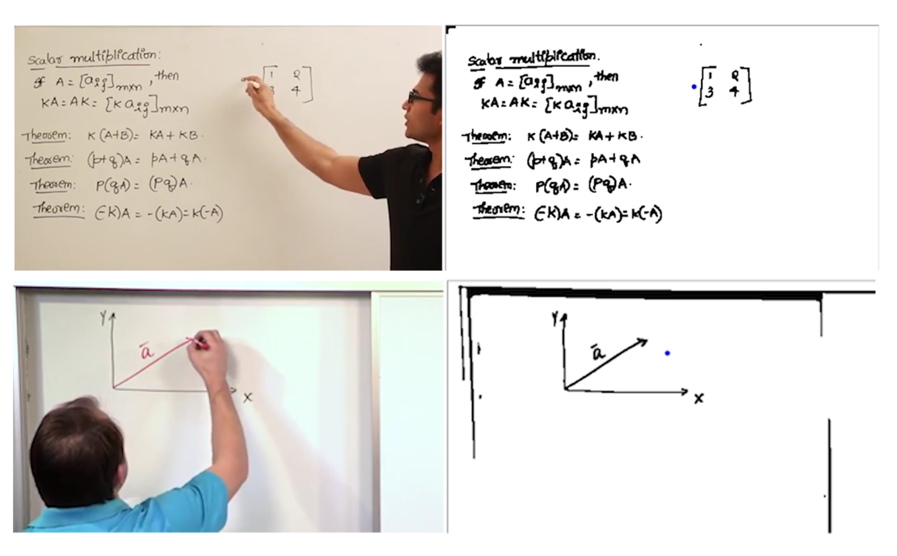

# Bandwidth Reduction for Online Streaming (BROS)
#### Problem Formulation:
Remove redundant information in the domain of online learning to reduce bandwidth needed to stream videos smoothly.

#### Instructions
To run the code you need to download the [model weights](https://drive.google.com/open?id=1A63-SeM1nZeB8d5VfW1cN3j0VSSIj01o) and put them in the Client folder. In the file Client/app.py are all the variables that you might want to change such as using a camera or a local file, and an option to render both a colored and a binarized image.

#### Results

#### Documentation
A detailed documentation can be [found here](https://drive.google.com/open?id=19PL7v864DR6zMe8YZwuvf0tsw9yDUB_Y).
An explanation video can be [found here](https://drive.google.com/open?id=1U0yhN_ns0gGvCQ1EkgkCCHOL2yXEwabu).

#### Team
We are High Ping (an ironic name):
Kareem Elsawah, Section A. Reducing Redundancies
Mohamed Sameh,  Section B. Tracking Instructor's Hand
Ali Ganzory,    Section C. Streaming, Reconstruction, and UI
